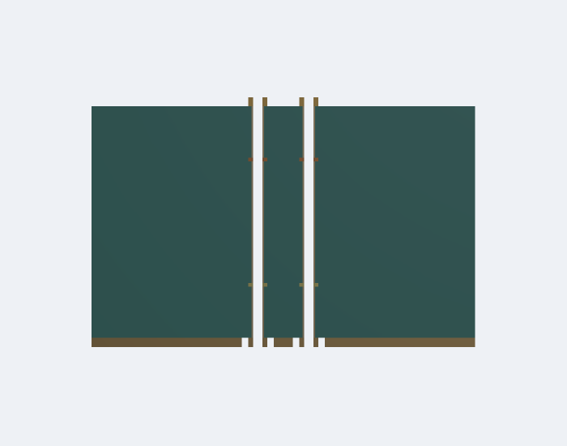
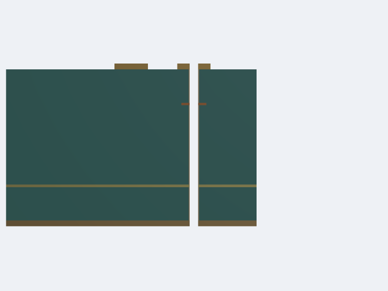

# circuit-json-to-gmsh

Convert tscircuit **circuit-json** into physical PCB CAD and Gmsh meshes. Inspect copper, plated barrels, dielectric interfaces and cross-sections with **PoppyGL**. Tests generate their circuit-json from TSX.


## Run on a tscircuit board

Export your circuit's JSON, then supply its manufacturing stackup. Units are millimetres; circuit coordinates use +Y up and +Z towards top copper.

```sh
bun install
python3 -m venv .venv
.venv/bin/pip install -r lib/python/requirements.txt
export GMSH_PYTHON="$PWD/.venv/bin/python"

bun lib/cli.ts board.circuit.json \
  --stackup-file stackup.json \
  --output work/board --conformal --mesh-size 0.5
```

On Linux, install `libglu1-mesa` if the Gmsh wheel needs `libGLU.so.1`.

A two-layer `stackup.json`:

```json
{
  "layers": [
    { "name": "top", "copperThicknessMm": 0.035 },
    { "material": "FR4", "dielectricThicknessMm": 0.8, "dielectricConstant": 4.3 },
    { "name": "bottom", "copperThicknessMm": 0.035 }
  ]
}
```

For multilayer boards, alternate copper and dielectric from top to bottom: `top`, `inner1`, `inner2`, …, `bottom`. Thicknesses and dielectric properties come from your fabricator. Physical via spans come from `pcb_via.layers` and plated-hole metadata; through-via stubs remain present.

The default export writes `board.brep`, `preview.json`, `preview.png`, `report.json`, `model.json` and `gmsh.log`. It is a CAD assembly with independently triangulated solids. `--conformal` partitions shared material interfaces and writes a tetrahedral `board.msh` with named copper-net and dielectric physical groups. `--cad-only` skips triangulation for large assemblies; `--step` adds STEP output.

The mesh size is a maximum target, in mm. Geometric features can force smaller elements. A successful mesh is a geometry check; EM accuracy still requires a solver and convergence testing. This converter does not use a frequency or excitation.

## Validate the saved mesh

Every `--conformal` export reloads `board.msh` in a fresh native Gmsh process and writes `validation.json`. It checks tetrahedron orientation/quality, per-volume material ownership and volume coverage, manifold faces, CAD interface triangle incidence, copper-net separation, and tetrahedra intersecting drill/cutout interiors. All CAD faces are saved as physical boundary groups; `mesh-manifest.json` records their expected adjacent volumes.

Request physical copper paths using refdes and pin aliases:

```sh
bun lib/cli.ts board.circuit.json --stackup-file stackup.json \
  --conformal --output work/board \
  --connection U1.P1:U3.F3 --connection U1.P2:U3.G3
```

These are **connectivity requirements**, not frequency sources or EM ports. Pin names, `pinN`, and `port_hints` resolve from source connectivity and PCB pads. Probes sit inside the physical copper thickness, away from co-located drills. Multi-layer terminal pads require an explicit layer/position through the library API.

```ts
import { createMeshRequirements, exportGmsh, validateMesh } from "circuit-json-to-gmsh"

const requirements = createMeshRequirements({
  circuitJson, model,
  connections: [{ from: "U1.P1", to: "U3.F3" }],
})
const result = await exportGmsh({
  model, outputDirectory: "work/board", conformal: true,
  validationRequirements: requirements,
})
console.log(result.validation?.connections)

// Also check an existing or externally modified saved mesh.
const report = await validateMesh({
  meshPath: result.meshPath!, manifestPath: result.manifestPath,
  model, requirements, outputDirectory: "work/recheck",
})
if (!report.passed) console.log(report.checks.filter((c) => c.passed === false))
```

`exportGmsh` rejects failed checks and retains the mesh, manifest, logs and validation report for reproduction. `validateMesh` returns failed checks for inspection. To recheck from the terminal:

```sh
bun lib/cli.ts validate work/board/board.msh \
  --manifest work/board/mesh-manifest.json --model work/board/model.json \
  --requirements-file work/board/validation-requirements.json \
  --output work/recheck
```

The validation CLI exits 1 on failure. Checks without their required model/manifest/endpoint requirements are explicitly incomplete; `pcbChecksComplete` requires all three. Floating copper islands are reported by net and only fail when a requested terminal path is broken. Cross-net contacts include coincident nodes with different tags, quantized at 0.0000001 mm. `--minimum-tet-quality` can impose a `minSICN` threshold; the default rejects nonpositive quality. Void intersections exclude a 0.000002 mm boundary tolerance to accommodate the 0.000001 mm CAD precision and reject projected overlap greater than `1e-10 mm²`. Tests include a tetrahedron crossing a drill despite all of its vertices lying outside the hole.

Only first-order tetrahedra and triangular boundaries are currently supported. Passing these checks establishes mesh consistency with the supplied geometry. It does not establish EM accuracy, a valid external-domain boundary condition, or a valid Palace lumped-port aperture.

## DQS mesh regressions

The TSX differential-pair regression checks two separate nets, through-via stubs below the routed `inner1` transition, hollow drills, and physical endpoint paths. Independent corruption tests remove interface triangles, disconnect coincident interface nodes, invert a tetrahedron, alter a material, add a short, fill a drill or board cutout, and remove an inner-layer copper segment.



The validated AM3352 source-via crop can be reproduced with:

```sh
bun scripts/validate-am3352-dqs.tsx \
  --board am3352.circuit.json --stackup am3352.stackup.json \
  --source-vias --output work/am3352-dqs --mesh-size 0.2 \
  --threads 1 --optimize-netgen
```

It retains every copper net and physical via span within the crop and checks both source pads through their full via stubs. Omitting `--source-vias` requests the complete paths `U1.P1 → U3.F3` and `U1.P2 → U3.G3`; full-route conformal partitioning remains expensive and has not yielded a validated mesh in the recorded runs. Input hashes, crop bounds, timing and validation results are saved. Cropping truncates other traces and reference planes, so this is a mesh-validation case; an EM extraction must separately validate domain size, boundary conditions, ports and frequency/mesh convergence. The general CLI accepts `--bounds minX,minY,maxX,maxY`; library exports accept `boundsMm`. Native CAD/mesh defaults to one thread for repeatable regressions; the library `threads` option enables native parallelism. `progress.json` and `validation-progress.json` identify the current stage of a long export.

The source-via case also emits a native cross-section. Use `--fragment-strategy slab` to partition material interfaces in batches within and between adjacent z slabs. The saved-mesh validator applies the same requirements to either strategy. `--optimize-netgen` enables native tetrahedron optimization. Reported worst-element coordinates and quality percentiles help distinguish a positive-volume mesh from a mesh with problematic slivers. Run large native jobs serially: they share the workspace memory limit. The AM3352 script's `--cad-only` mode saves the assembly without fragmentation or meshing for isolation and independent CAD validity checks.

`--fragment-strategy tiled --tile-size 2.5 --tile-workers 4 --tile-cache work/cad-cache` performs bounded XY CAD batches in isolated native processes, then joins four-cell blocks, including corner contacts. These are internal CAD subdivisions; they do not introduce EM boundaries. Batch caches verify geometry, exporter implementation, native version and file hashes. Reloaded solids must retain unique material ownership, and the final mesh must still pass the saved-mesh checks. `tileSizeMm` controls CAD workloads, independently of `meshSizeMm`.

Cached tiles can be meshed individually before an expensive join:

```sh
"$GMSH_PYTHON" scripts/validate-cached-tile.py \
  --tile work/cad-cache/TILE_HASH --model work/board/model.json \
  --output work/tile-preflight --mesh-size 0.4 --check-brep
```

This verifies the job, BRep and ownership-catalogue hashes, preserves material ownership on reload, applies the exporter's total-volume criterion to the tile, records per-solid volume differences, and independently validates its saved mesh. `--check-brep` requires the optional OpenCASCADE test dependencies. `--minimum-quality` defaults to zero (strictly positive tetrahedra). The report explicitly sets `completeRouteValidated: false`: individual tiles do not establish conformity across joins or complete-route terminal paths.

The completed tiled CAD is independently reloaded before meshing. A twelve-cell TSX regression exposed Gmsh 4.13.1 emitting node `0` references after repeated OCC edits despite reporting successful mesh generation; BRep reload resolves the reproduction. Missing node references are explicitly rejected, and the saved-mesh gates still apply. A hash-verified `cad-checkpoint.brep` plus its ownership catalogue can be reused with `--cad-checkpoint work/coarse` (library `cadCheckpointDirectory`) to remesh into a different output directory. Keep all geometry, ports, crop, air and tiling settings identical; only mesh/optimization settings may change. Every refinement is validated again.

Cropping can create resin wedges below OpenCASCADE's tolerance. A cropped dielectric island is transferred to copper only if its area is at most `1e-6 mm²`, it cannot contain a `1e-5 mm` (10 nm) inset, it touches the crop edge, and it has exactly one neighbouring copper net. Drills are protected; ambiguous ownership is rejected. The 1 nm coordinate grid can round the union locally; any change must stay within 2 nm of the wedge, with boundary displacement at most 1.5 nm, and cannot overlap another net. `report.json.sliverRepairs` records the net, bounds, wedge area, actual copper addition, dielectric removal, grid rounding and transferred volume. This is an explicit geometry approximation, not an exact fabrication model.

`tile-partition.json` records all internal subdivision axes. Interior planes move by at most 0.025 mm to keep a 0.002 mm clearance from nearby parallel copper edges and barrel/drill extrema. These are CAD subdivisions; moving them does not change physical geometry. A TSX regression checks material volume, conformity and `minSICN > 0.001` after avoiding a 0.231 µm strip.

The AM3352 script widens crop boundaries that would graze circular barrel rims, recording every change in provenance. Such a crop can otherwise leave a 0.12 µm copper sliver and produce poor tetrahedra despite preserving copper connectivity. A TSX regression reproduces and rejects that case at `minSICN > 0.001`, then verifies the expanded crop. Actual-board measurements, cross-sections and resource-failure receipts are in [the DQS validation evidence](examples/am3352/mesh-validation/README.md).

For exceptionally detailed contours, `--simplify-tolerance 0.001` (library `simplifyToleranceMm: 0.001`) enables a **1 µm geometry approximation**. The default is zero. Physical drill and board-cutout interiors remain exact; changes must preserve per-layer polygon component/hole counts and net separation. Physical contours are simplified **before** the analysis-domain crop, so artificial crop edges are never approximated as copper features. Every contour records its measured discrete Hausdorff boundary distance, vertex counts, and added/removed copper area. Approximating contours can affect impedance and loss: validate tolerance sensitivity separately before using an EM result. `simplification.json` and the geometry report retain the audit.

`--corridor-margin 0.5` crops the AM3352 analysis domain to a 0.5 mm neighbourhood of the two complete routes, with recorded expansions around intersected via barrels. The library equivalent is `routeCorridor: { netIds: [positiveNetId, negativeNetId], marginMm: 0.5 }`. All copper inside that domain is retained, including other nets. The exported `route-corridor.json` records the actual polygon and bounded 10 nm cleanup of almost-collinear artificial crop edges. Physical board outlines and drills are retained. Omitting this option uses the rectangular crop. This reduces CAD workload but truncates reference planes; it is not a validated EM domain size.

## Brief library usage

Run with Bun and the same Python setup:

```tsx
import { Circuit } from "@tscircuit/core"
import {
  createGeometryModel, parseCircuitJson, exportGmsh,
} from "circuit-json-to-gmsh"

const circuit = new Circuit()
circuit.add(<MyBoard />)
await circuit.renderUntilSettled()
const model = createGeometryModel({
  circuitJson: parseCircuitJson(circuit.getCircuitJson()),
  stackup, // fabrication stack, as above
})
const { report, brepPath, meshPath } = await exportGmsh({
  model, outputDirectory: "work/board", conformal: true,
})
```

The initial package is not published to npm. Inside this repo use `./lib/index.ts` for the import, or link the package locally.

## Palace channel extraction

Frequency and excitation belong to Palace. Native coplanar ports currently support **outer-layer pads** with an explicit reference net. Do not assume a power net is an ideal AC ground. Package parasitics, discrete capacitors, driver/receiver models and jitter are separate from this PCB field extraction.

```ts
const requirements = createMeshRequirements({
  circuitJson, model,
  connections: [
    { from: "U1.OUT", to: "U2.IN" },
    { from: "U1.GND", to: "U2.GND" },
  ],
})
const groundNetId = requirements.terminals.find((t) => t.name === "U1.GND")!.netId
const result = await exportGmsh({
  model, outputDirectory: "work/channel-mesh", conformal: true,
  airPaddingMm: 1, validationRequirements: requirements,
  lumpedPorts: requirements.terminals
    .filter((terminal) => terminal.netId !== groundNetId)
    .map((terminal) => ({ terminal, referenceNetId: groundNetId, widthMm: 0.08 })),
})
```

The port builder checks native aperture area, signal/reference contacts and reference copper continuity. It writes `ports.json`; it rejects apertures spanning multiple gaps or overlapping another port. Ports still require impedance and placement sensitivity checks.

Palace's uniform port also requires a rectangular aperture aligned with its excitation; an irregular gap around curved pads can fail that native check. For such a case, export with `fragmentStrategy: "tiled"` to retain a hash-verified CAD checkpoint, then add **explicit ideal PEC end-contact fixtures**:

```sh
"$GMSH_PYTHON" scripts/palace/rectangularize-ports.py \
  --mesh-directory work/channel-mesh --output work/channel-fixtures \
  --mesh-size 0.4 --width-fraction 0.95
```

Use `work/channel-fixtures` as the preparation input. This preserves every PCB material volume, verifies intended contact nets and repeats all saved-mesh checks. It records the added ideal contacts in `ports.json` and `port-fixtures.json`; modified receipts are rejected. The contacts alter near-port fields and require fixture-size sensitivity/de-embedding before routing-quality claims. [AM3352 and oblique TSX native evidence](examples/am3352/palace-channel/README.md#actual-am3352-dqs0-case) includes geometry plots and Palace's original rejection.


Reproduce the small TSX control and prepare a sweep (frequency arguments are **Hz**):

```sh
bun scripts/generate-palace-control.tsx --output work/control-mesh
"$GMSH_PYTHON" scripts/palace/prepare-channel.py \
  --mesh-directory work/control-mesh --output work/control \
  --frequency-hz 100000000 400000000 1000000000 2000000000 5000000000
```

The preparation script requires complete passing PCB checks and verifies the validated files' hashes. It replaces finite-thickness copper volumes with **PEC cavities**: copper loss is omitted, while dielectric loss is retained. The air enclosure uses a first-order absorbing boundary. These are baseline assumptions requiring separate validation.

Run every generated configuration with Palace 0.14.0; each excites one port to obtain one full S-matrix column:

```sh
cd work/control
palace -np 2 palace-1.json > palace-1.log 2>&1
palace -np 2 palace-2.json > palace-2.log 2>&1
cd ../..
"$GMSH_PYTHON" scripts/palace/read-channel.py work/control
```

Outputs include raw `channel.sNp`, complex `channel.npz` and `channel-report.json`. Incomplete sweeps and failed solvers are rejected. Reciprocity/passivity violations are reported without changing solver values. For four ports, use `--pairs '1,3;2,4'` to pair source positive/negative ports 1/3 and load ports 2/4; the power-normalized conversion writes `mixed-mode.csv` and `mixed-mode.npz`. At 50 Ω per leg the differential reference is 100 Ω and common-mode reference is 25 Ω.

Compare at least three progressively refined meshes or polynomial orders with `read-channel.py --compare work/coarse work/medium work/fine --output work/convergence.json`. Geometry/manifest, frequency, ports and reference impedance must match. The default criterion requires both last refinement changes to be at most 0.01 in every complex S entry, plus reciprocity/passivity checks. This criterion does not establish crop, enclosure, material or port accuracy. Sparse sweeps are diagnostics; broadband transient/eye modelling needs a sufficiently dense sweep, low/high-frequency treatment and a checked causal passive channel fit.

See [Palace validation evidence and actual-board status](examples/am3352/palace-channel/README.md) for the analytical benchmark, TSX control and AM3352 reproduction.

## Cross-sections and visual snapshots

The actual AM3352 crop is available as a [copper-only PoppyGL view](examples/am3352/mesh-validation/dqs-source-vias-corrected/copper-only.png), with a [native cutaway](examples/am3352/mesh-validation/dqs-source-vias-corrected/copper-cutaway.png) through the DQS source via. The substrate is hidden; DQS0 is red and DQSn0 is cyan. See [reproduction instructions](examples/am3352/mesh-validation/README.md#copper-only-visual-verification). These actual-board views appear first in the visualizer.

```ts
import { exportGmsh, crossSection, renderGeometry } from "circuit-json-to-gmsh"

const cut = await exportGmsh({
  model, outputDirectory: "work/cut", cutawayX: 2, conformal: true,
})
const png = await renderGeometry({
  solids: crossSection({ solids: cut.preview, xMm: 2 }),
  zScale: 4,
  render: { camPos: [15, 1.5, 1.8], lookAt: [2, 1.5, 1.8] },
})
await Bun.write("work/section.png", png)
```

The cutaway is made before native CAD extrusion. The flat section keeps only triangulated Gmsh faces on that cut plane. `zScale` affects the preview; exported CAD and mesh keep their physical thicknesses.



Orange/brown is copper; green is dielectric. The white vertical opening is the drill. Etched inner-foil spaces contain resin from the upper adjacent dielectric; outer-foil spaces remain exterior air. Solder mask and component bodies are omitted.

Run `bun start` for the Cosmos visualizer, `bun run build:site` for its static export, and `bun run generate:examples` to regenerate the TSX example.

## AM3352 CAD reproductions

The legacy AM3352 export's ground assembly contained **two invalid OCC solids out of 801**:

| Solid | Cause | Location (mm) |
| --- | --- | --- |
| `foil/top/102` | A hole touches the exterior at a single point | `(7.55, 1.15)` |
| `foil/bottom/2` | Five pairs of hole boundaries touch at single points | See [reproduction evidence](examples/am3352/README.md) |

The bottom-plane contacts were introduced by the legacy exporter's square antipads. The default now offsets the actual pad outlines by the configured radial clearance, preserving the supplied circular voids. `antipadShape: "bounding-box"` (CLI `--antipad-shape bounding-box`) retains the old shape for reproductions or deliberately rectangular antipads.

The top case is `U1.VSS_OSC_V11` → `pcb_trace_105` → `pcb_via_83`. These polygons are valid in GEOS, and their extruded volumes are correct, but OpenCASCADE's `BRepCheck_Analyzer` rejects the solids. Checking volume or mesh generation alone missed this.

The exporter detects these pinches before extrusion. By default it removes a local square notch with half width **0.0001 mm (0.1 µm)**. It verifies that the repair keeps one connected copper region and adds no copper. Every repair, coordinate, bound, removed area and total volume change appears in `report.json`. The top reproduction loses `3.9015e-8 mm²` of copper. Set `repairRadiusMm: 0`, or CLI `--repair-radius 0`, to reject the input and save the isolated polygon in `failure.json`.

Foils and barrel cross-sections are also united in 2D before extrusion into non-overlapping z intervals, avoiding the former union of 801 overlapping ground volumes. Through-via depths and physical foil thicknesses are retained.

Both defect classes have TSX reproductions, native BREP validity checks, conformal mesh checks and PoppyGL snapshots. The full-board default CAD assembly exported **5,572 solids in 288 seconds**, using **11.7 GiB** peak RSS. Only two local pinches remain after using pad-outline antipads: top GND and inner1 `DDR_VREF`. Their total removed volume is `1.96e-9 mm³`; the input hash and measurements are in [the benchmark receipt](examples/am3352/full-board-cad-benchmark.json).

Full-board **CAD assembly** export is benchmarked separately from a solver-ready, conformal full-board mesh. The original Palace Boolean failure is not a completed Palace simulation.

## Development

```sh
.venv/bin/pip install -r lib/python/requirements-test.txt
GMSH_PYTHON="$PWD/.venv/bin/python" bun test
bun run typecheck
bun run format:check
python -m ruff check lib/python
```

Update reviewed visual baselines with `UPDATE_SNAPSHOTS=1 bun test`. Missing snapshots fail normally. CI runs native Gmsh and OpenCASCADE checks; it also builds the Cosmos visualizer.

For an independent CAD check:

```sh
.venv/bin/python lib/python/validate_brep.py --brep work/board/board.brep
```

Tests pin Gmsh 4.13.1, GEOS through Shapely 2.1.2, and OCP 7.8.1.1.post1. Circular input copper and drills use 32-sided polygons; plating is currently 0.025 mm. Generated foreign-net plane antipads offset the copper footprint on each layer (supplied pads where present, barrel outer wall elsewhere) by the configured `viaClearance` or board clearance. Existing pours, all copper nets, physical holes and cutouts are retained; unresolved ownership, absent layers and cross-net overlap are errors.
