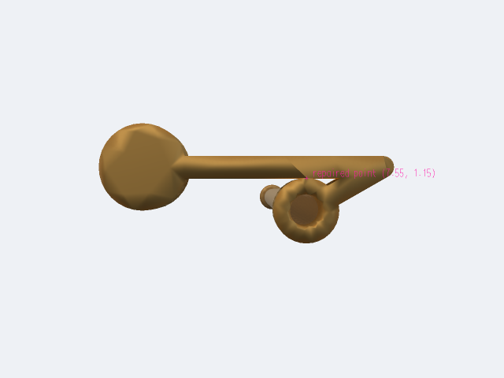
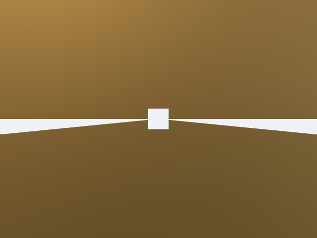
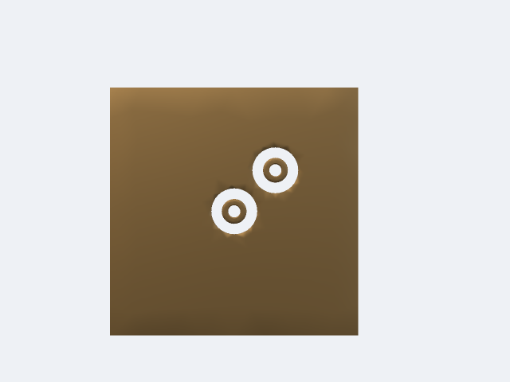
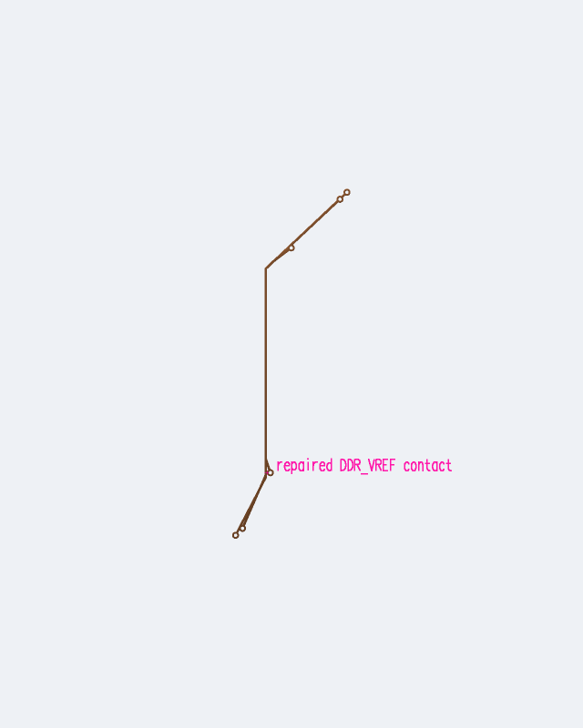

# AM3352 geometry reproductions

Source: [astra/am3352-sbc](https://tscircuit.com/astra/am3352-sbc#files). Input hash, source element IDs, geometry version and coordinates are pinned in [provenance.json](provenance.json).

A ground-only OCC validity scan found **two invalid solids out of 801**; the [scan receipt](ground-validity.json) is retained. Their expected and native volumes matched. The defect is a polygon hole touching another boundary at a point, which GEOS permits but OCC rejects as a solid.

- **Top:** `U1.VSS_OSC_V11`, `pcb_smtpad_197`, `pcb_trace_105`, `pcb_via_83`. Contact `(7.55, 1.15)` mm.
- **Bottom:** the legacy export's square generated antipads touch at `(-34.95,-4.65)`, `(-8.55,4.05)`, `(-0.15,7.55)`, `(9.85,-6.65)`, `(13.05,1.55)` mm. These were exporter artifacts. The default converter offsets the actual pad shape; it removes these contacts without changing the board's circular clearances.
- **Inner1:** the all-net export also detects a point contact on `DDR_VREF` at `(-10.95,-23.6)` mm. It is the same trace-to-round-pad defect class as the top-ground case.

Original and repaired native BREPs and minimal GeoJSON polygons are checked in. The bottom source reproduction is cropped to a 1.5 × 1.5 mm region containing one pair of touching voids. [Native validity receipts](minimal-validation.json) confirm the originals are invalid and the repaired solids are valid and mesh successfully. CI checks them with `BRepCheck_Analyzer` independently of the exporter.

Regenerate an isolated source case from its GeoJSON with:

```sh
.venv/bin/python scripts/reproduce-source-solids.py \
  --case top-pinched-hole --output work/reproductions
```

This emits both native BREPs, a validity receipt, and repaired surface triangles for PoppyGL. The same command accepts `bottom-touching-antipads` and `ddr-vref-inner1`.

```sh
.venv/bin/python lib/python/validate_brep.py \
  --brep examples/am3352/top-pinched-hole-original.brep
.venv/bin/python lib/python/validate_brep.py \
  --brep examples/am3352/top-pinched-hole-fixed.brep
```

The TSX cases are [pinched-hole-board.tsx](../../tests/fixtures/pinched-hole-board.tsx) and [touching-antipads-board.tsx](../../tests/fixtures/touching-antipads-board.tsx). Their tests produce circuit-json, run native CAD/mesh generation, check validity, preserve three distinct nets in the antipad case, and compare PoppyGL snapshots.



Native upper-face detail of the repaired trace/via contact, centred at `(7.55,1.15)` mm. Display coordinates are scaled to micrometres. The square opening is **0.2 µm wide**; CAD coordinates remain physical millimetres.



The default offset antipads below retain a finite gap between the two circular voids:



The optional bounding-box reproduction is locally regularized and audited:


The legacy whole-ground union and large bottom-plane union exhausted the 16 GiB workspace during concurrent reproductions. Those runs are resource failures; they do not reproduce the earlier `BOPAlgo_AlertIntersectionFailed` exception. The invalid-solid findings are independently reproduced with tiny CAD cases. A repaired full-board conformal Palace mesh has not yet been validated.

The [default full-board benchmark](full-board-cad-benchmark.json) produced 5,572 CAD solids in 288 seconds (4 min 48 s), with 11.7 GiB peak RSS. It preserved every copper net and used no wholesale outline simplification. This is CAD assembly output; conformal full-board meshing and Palace remain separate work.

The actual inner1 `DDR_VREF` solid after repair:


