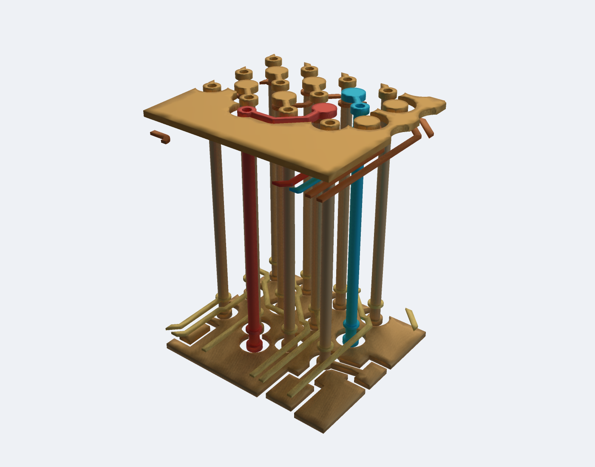
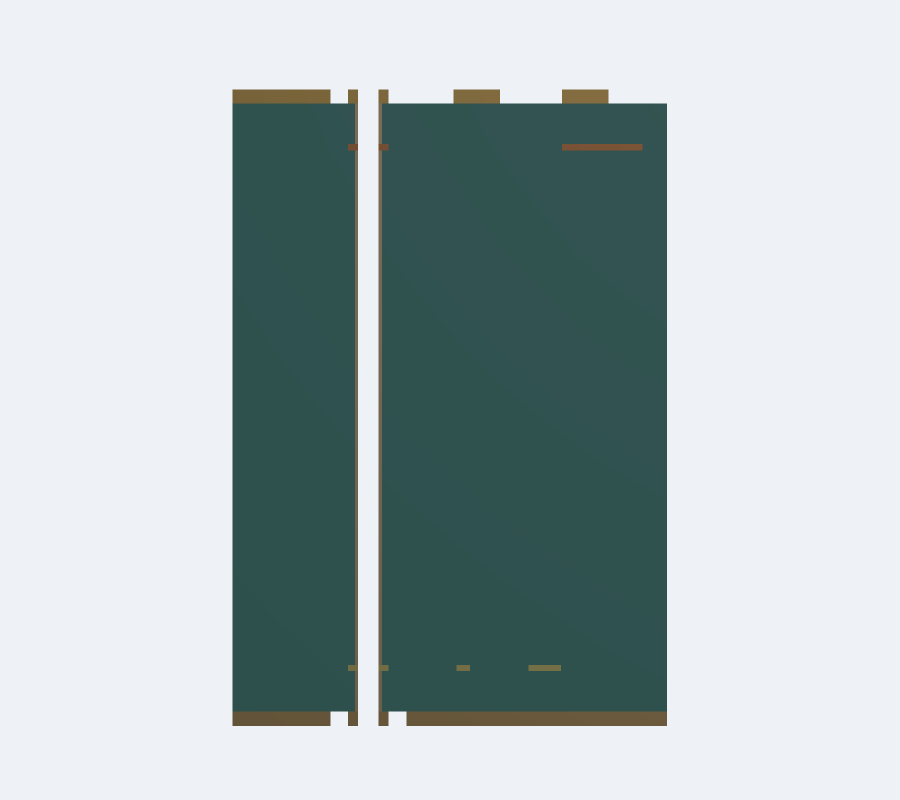

# AM3352 DQS mesh validation evidence

Source: https://tscircuit.com/astra/am3352-sbc#files. The circuit-json input SHA-256 is `c9d7059fe536865784f175855e0dcc76510972319eec848c18b0ef6dcd2adb40`. The selected JLC04161H-3313 fabrication stack is in [stackup.json](stackup.json); this is a simulation assumption, not a manufacturing sign-off.

The saved source-via cases retain all copper inside the rectangular crop and check both source pads through their physical through-via stubs: `U1.P1 → U1.P1.bottomStub` and `U1.P2 → U1.P2.bottomStub`. They do not include the complete paths to the DRAM.

## Copper-only visual verification

This is the **actual AM3352 copper**, rendered from the validated native Gmsh preview with PoppyGL. The substrate is hidden. Red is DQS0; cyan is DQSn0; all other copper is retained and colored by layer. The crop is approximately 3.55 × 3.2 mm around the source vias. Z is exaggerated 3× for inspection; XY and the exported geometry retain their physical dimensions.



The [DQS-only view](dqs-source-vias-corrected/dqs-copper-only.png) exposes both signal transitions and their lower stubs. The [native copper cutaway](dqs-source-vias-corrected/copper-cutaway.png) cuts through the red source via at x = 2.7 mm to expose its hollow barrel. Clipped copper at the rectangular crop edges is not a physical PCB edge.

After generating the source-via mesh below, reproduce these images with:

```sh
bun scripts/render-am3352-copper.ts \
  --preview work/am3352-source-vias/preview.json \
  --section-preview work/am3352-source-vias/section/preview.json \
  --output work/am3352-copper
```

`copper-render.json` records the source and preview hashes, crop bounds, colors and camera. `bun start` opens the visualizer with these actual-board views first.

| Case | Target size | Tetrahedra | Export + validation | Native peak RSS | minSICN minimum / 1st percentile |
| --- | --- | --- | --- | --- | --- |
| Original crop, global partition | 0.4 mm | 91,839 | 129.19 s | 1,305 MiB | 0.000377 / 0.0442 |
| Same crop, slab partition + Netgen | 0.2 mm | 151,669 | 367.49 s | 396 MiB | 0.000502 / 0.1053 |
| Expanded crop, global partition + Netgen | 0.2 mm | 181,224 | 201.46 s | 1,575 MiB | 0.002009 / 0.1086 |

All nine saved-mesh checks pass at the default positive-quality threshold. OpenCASCADE independently reports all 115 solids valid in the original cases and all 114 valid in the expanded crop. The expanded crop also passes an independent `minSICN > 0.001` recheck, retained in [quality-gate.json](dqs-source-vias-corrected/quality-gate.json). This is **not adequate evidence of EM accuracy**: small dielectric cells still occur near the crop boundary. The refined run used the earlier two-pass slab partition (within each slab, then adjacent pairs); current slab partition avoids that redundant first pass. These are measured configurations, not a controlled speed comparison; smaller diagnostics ran concurrently with the expanded-crop run.

The five worst refined cells are copper on neighbouring nets at the crop's `x = 1.7 mm` edge. The crop grazes barrel rims at `x ≈ 1.700121 mm`, leaving a **0.12 µm wide cap** across the 1.265 mm core. Decreasing the target mesh size does not fix the geometric cause. The current AM3352 script widens boundaries near barrel rims; a mandatory TSX regression reproduces this failure, rejects it with `minimumTetQuality: 0.001`, and verifies the expanded crop preserves connectivity while passing that threshold.



Copper is brown, dielectric is green, and the white opening is the physical drill. The section shows the through-via continuing below the routed inner-layer transition. Layer views and complete validation reports are saved beside the image.

## Reproduction

The checked-in TSX tests generate their circuit-json with `@tscircuit/core` and reproduce the differential-via and grazing-crop defects without downloading the large board. Run:

```sh
GMSH_PYTHON=.venv/bin/python bun test tests/mesh-validation.test.tsx tests/differential-vias.test.tsx
```

For the actual board, the exact input is retained as `am3352.circuit.json.gz` (734 KB compressed). Use it with the included stackup:

```sh
bun scripts/validate-am3352-dqs.tsx \
  --board examples/am3352/mesh-validation/am3352.circuit.json.gz \
  --stackup examples/am3352/mesh-validation/stackup.json \
  --source-vias --output work/am3352-source-vias \
  --mesh-size 0.2 --threads 1 --optimize-netgen
```

This command uses the corrected crop. To reproduce the original grazing crop exactly, read `dqs-source-vias/provenance.json` and pass its `boundsMm` and `requirements` to `exportGmsh` with `conformal: true`, `meshSizeMm: 0.4`, `threads: 2`, and global partition. A separate recheck at `minimumTetQuality: 0.001` must fail. The benchmark's timer excludes image generation and the extra cross-section export. Peak RSS is the native export process's Linux `ru_maxrss`, not aggregate workspace memory.

The reports retain mesh/model/manifest/requirements hashes, quality distributions, worst-cell coordinates, and physical terminal probes. Large mesh and model binaries are generated locally rather than committed.

## Resource failures and scope

The full rectangular DQS crop has not produced a validated conformal mesh in these runs. [The global resource receipt](dqs-global-resource-failure.json) records exit 137 when concurrent native jobs exhausted the shared 16 GiB memory limit. That is neither an isolated serial-memory benchmark nor a reproduced Boolean topology exception. Exact and simplified rectangular slab jobs were explicitly stopped after observing approximately 10 GiB RSS; their stop receipts retain the partition stage and timing.

The 0.5 mm route corridor with a 1 µm contour approximation produced **523 CAD solids in 29.67 seconds**, all independently valid in OpenCASCADE. Conformal partitioning was explicitly stopped after **1,273 seconds**, during the second interface stage, at approximately 2 GiB RSS. Its first stage took 665 seconds. There is no successful full-route mesh in that case. Receipts, domain geometry and contour changes are in [dqs-route-corridor](dqs-route-corridor).

Regenerate the assembly separately to inspect the slow partition input:

```sh
bun scripts/validate-am3352-dqs.tsx \
  --board examples/am3352/mesh-validation/am3352.circuit.json.gz \
  --stackup examples/am3352/mesh-validation/stackup.json \
  --output work/dqs-cad --cad-only --corridor-margin 0.5 \
  --simplify-tolerance 0.001 --threads 1
.venv/bin/python scripts/isolate-slab-interface.py \
  --brep work/dqs-cad/board.brep --lower -0.035 --upper 0.0994 \
  --output work/dqs-bottom-interface.brep
.venv/bin/python lib/python/validate_brep.py --brep work/dqs-bottom-interface.brep
```

The first-stage subset is also retained as `dqs-route-corridor/dqs-bottom-interface.brep.gz`: 42 complete, independently valid solids. Extraction selects existing solids by z interval and does not create cut surfaces. It identifies a performance reproduction subset, not an invalid solid.

Every copper net inside the corridor remains included. Cropping reference planes and approximating contours require sensitivity testing before EM extraction. No air domain, Palace port aperture, S-parameters, or eye diagram is validated by these mesh checks.
