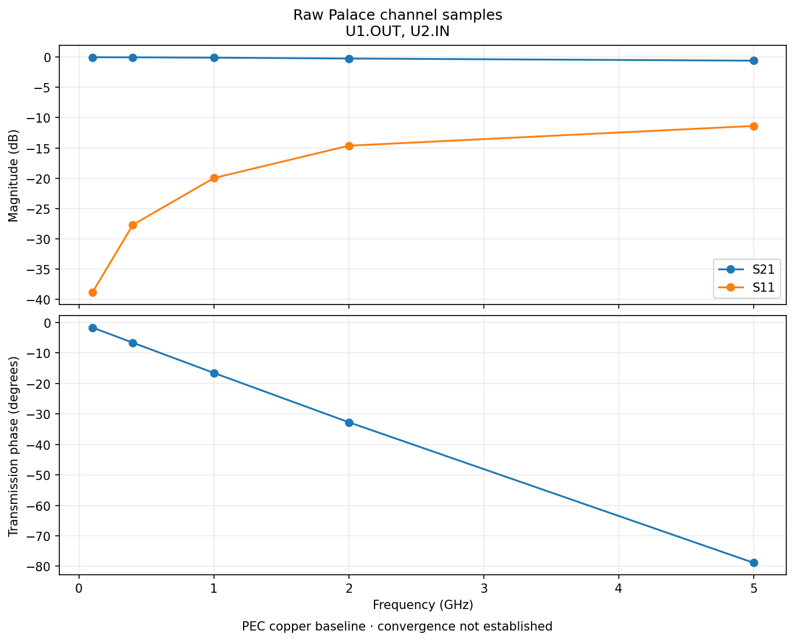
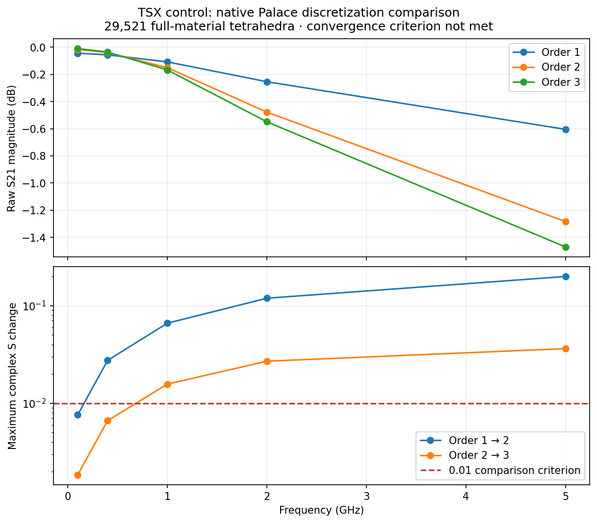
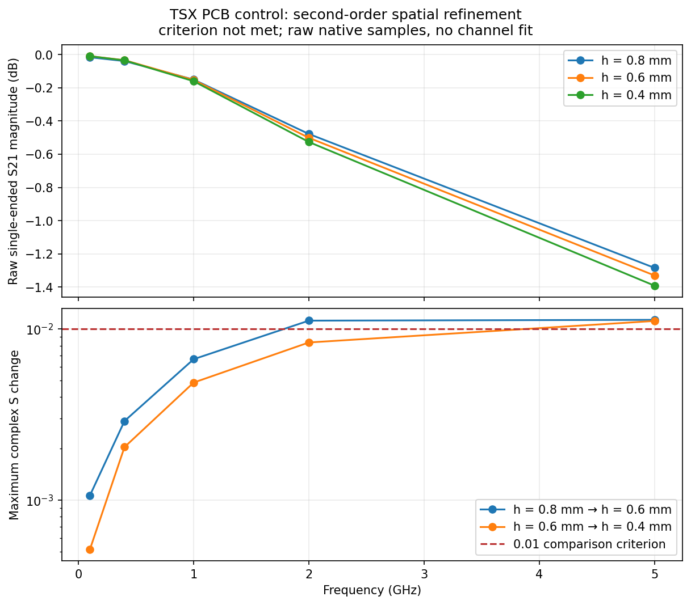
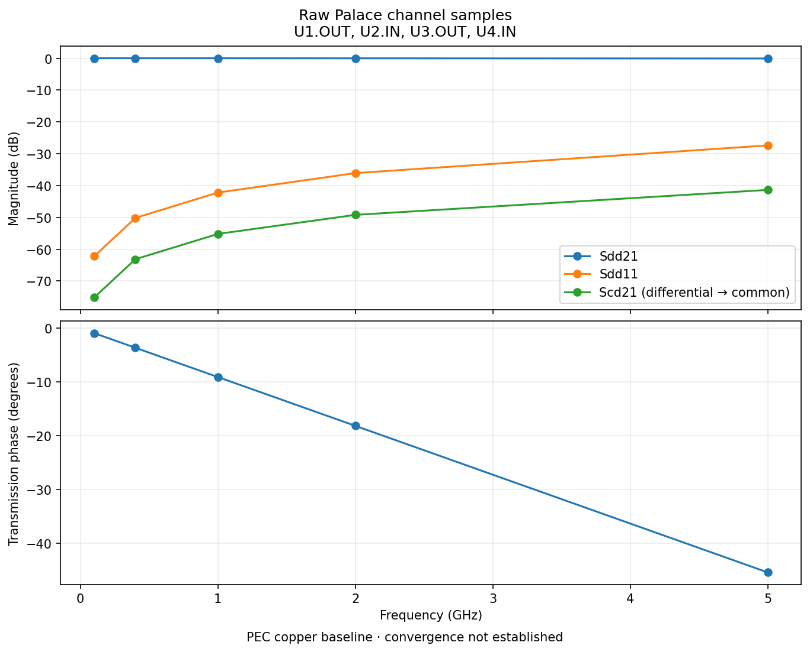
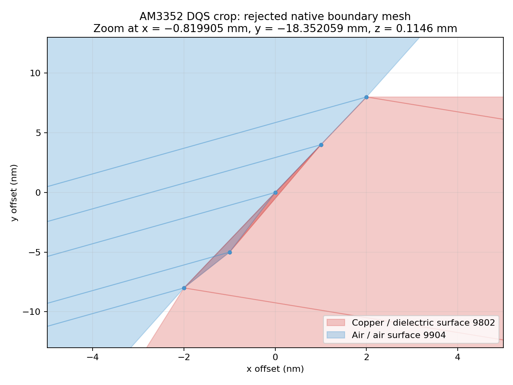
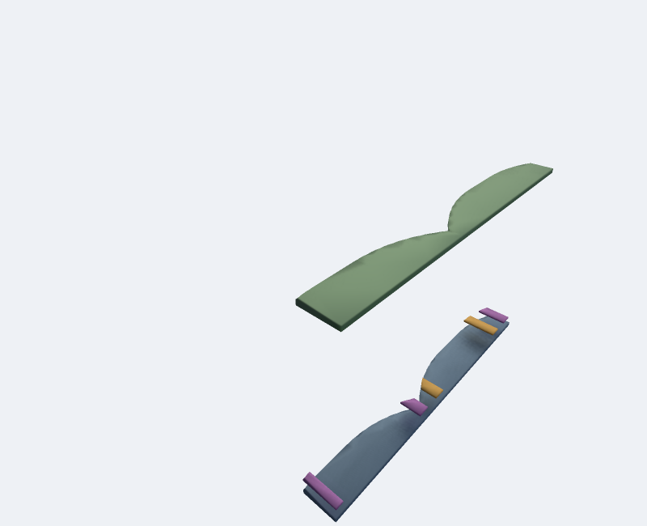
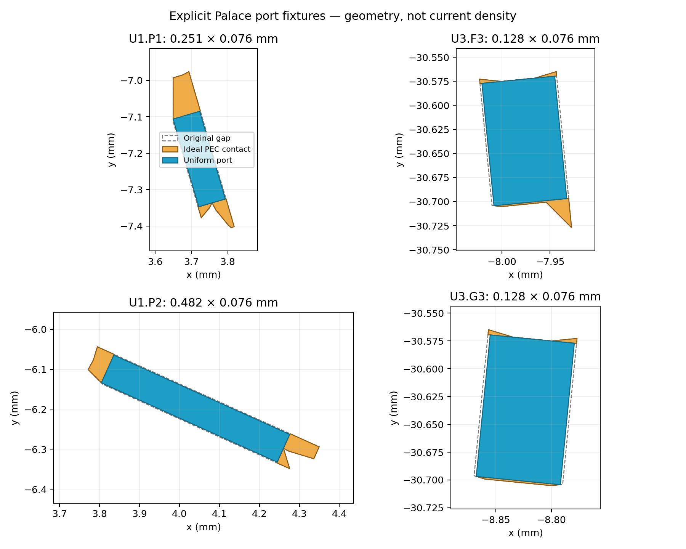

# Palace channel validation

This work separates three questions: whether the saved PCB mesh is consistent, whether the field extraction is numerically accurate, and whether the physical channel assumptions represent the board. An eye diagram should follow those checks, using the extracted broadband channel plus driver/receiver and timing models.

## Completed analytical benchmark

The parallel-plate control has a known TEM solution: length 10 mm, width 5 mm, separation 0.2 mm, relative permittivity 4, PEC plates and natural PMC side boundaries. The matched port impedance is 7.534606 Ω, propagation delay is 66.713 ps, `S11 = 0`, and `S21 = exp(-j 2π f delay)`. This checks field solution, units and port normalization independently of a PCB return-current approximation.

Palace 0.14.0 was run at 100 MHz, 400 MHz, 1 GHz, 2 GHz and 5 GHz, with first-order fields:

| Target size (mm) | Tetrahedra | Maximum complex S21 error | Maximum \|S11\| |
| --- | ---: | ---: | ---: |
| 1 | 383 | 4.47e-4 | 1.25e-3 |
| 0.5 | 1,455 | 1.25e-3 | 1.52e-3 |
| 0.25 | 6,055 | 6.25e-5 | 1.29e-4 |
| 0.125 | 22,959 | 8.62e-5 | 6.64e-5 |

Errors are not monotonic on these unstructured meshes. Both finer cases approach the exact solution to approximately `1e-4`; this is a benchmark agreement measurement, not an AM3352 convergence result. [Results](tem/results.json) and each directory's raw native log, config and S-parameter CSV are retained.

Reproduce a mesh and solve:

```sh
"$GMSH_PYTHON" scripts/palace/benchmark-tem.py --out work/tem --size 0.125
cd work/tem
palace -np 2 palace.json > palace.log 2>&1
cd ../..
"$GMSH_PYTHON" scripts/palace/check-tem.py work/tem --output work/tem-results.json
```

The analytical fixture is explicitly a mathematical boundary-value benchmark. PCB regressions and the channel control below generate circuit-json from TSX.

## Completed TSX PCB control

[`MultilayerBoard`](../../../tests/fixtures/multilayer-board.tsx) generates a four-layer board with two signal terminals, routed layer transitions, hollow plated vias and ground copper. The [control generator](../../../scripts/generate-palace-control.tsx) places native coplanar `U1.OUT` and `U2.IN` ports against their explicit GND net. It requires signal and reference continuity, and all saved-mesh checks pass.

The first-order extraction used 29,521 full-material tetrahedra, 50 Ω per port and the same five frequencies. Both excitation directions completed. The largest reciprocity error is `1.12e-7`; the largest S-matrix singular value is `0.999983`. These are numerical consistency checks, not established discretization convergence.



[Raw Touchstone](tsx-control/channel.s2p), [report](tsx-control/channel-report.json), [solver receipt](tsx-control/solver-input.json) and configs are retained. The corresponding native logs and raw CSV columns are in [the reader test fixture](../../../tests/fixtures/palace-channel). Tests reject incomplete sweeps and report deliberately nonpassive data without correcting it. A constructed four-port parser test checks differential/common-mode polarity and Touchstone ordering; it is not a native four-port simulation.

Both second-order excitation directions also completed. The [second-order report and raw results](tsx-control/p2/channel-report.json) have a maximum reciprocity error of `4.60e-7`, but the maximum change from first order is **0.199** in a complex S entry. The first-order PCB result is therefore **not converged** under the 0.01 criterion. This is precisely why consistency checks alone are insufficient for judging routing. One second-order direction used the default polynomial multigrid preconditioner (378 s); the other used a full-order complex SuperLU preconditioner (131 s). Their preserved configs show those linear-solver settings; both used residual tolerance `1e-8`.

Both [third-order excitation directions](tsx-control/p3/channel-report.json) completed using polynomial multigrid (1,960 s and 2,044 s). Maximum reciprocity error is `9.66e-7` and maximum scattering singular value is `0.999994`. The [three-order comparison](tsx-control/refinement.json) reports maximum complex changes of **0.199** from order 1 → 2 and **0.0362** from order 2 → 3. This control **still fails** the 0.01 discretization criterion. A full-order direct third-order attempt ended with SIGKILL under the workspace's 16 GiB memory limit; its [incomplete log](tsx-control/p3-direct-incomplete.log) is retained and is excluded from channel results.



The [per-frequency comparison values](tsx-control/refinement-samples.csv) preserve the raw sample differences; a clock-frequency point cannot establish an eye model over the edge-transition bandwidth.

At **400 MHz only**, a separate second-order spatial-refinement study used target mesh sizes 0.8, 0.6 and 0.4 mm (29,521, 36,313 and 61,340 full-material tetrahedra). Both directions completed on each mesh. The maximum complex S changes were **0.00290** and **0.00204**, passing the 0.01 discretization comparison. [Raw results and comparison](tsx-control/400mhz/refinement.json) are retained. This is a validated numerical comparison for the control at one frequency; it does not establish broadband eye accuracy or the AM3352 physical model. Repeat `generate-palace-control.tsx --mesh-size SIZE` at each size, prepare with `--order 2 --frequency-hz 400000000`, run both columns, then compare all three directories.

The same second-order **0.8 → 0.6 → 0.4 mm** spatial study has now completed across all five diagnostic frequencies. Both directions pass numerical consistency on each mesh, but maximum complex S changes are **0.01133** and **0.01116**, so the broadband study still fails the 0.01 comparison. [Reports, raw logs/CSV and Touchstone](tsx-control/spatial/refinement.json) are retained. The 0.6 mm excitations took 532/543 s; the 0.4 mm excitations took 852/710 s (mean MPI-rank wall time; these runs shared the workstation with CAD jobs).



To plot a freshly solved study, `plot-refinement.py` first revalidates the native data and comparison, then writes the raw sample changes, report and figure:

```sh
"$GMSH_PYTHON" scripts/palace/plot-refinement.py \
  --runs work/h08 work/h06 work/h04 \
  --labels 'h = 0.8 mm' 'h = 0.6 mm' 'h = 0.4 mm' \
  --output-directory work/refinement --title 'PCB control spatial refinement'
```

A symmetric [four-port TSX control](../../../tests/fixtures/differential-board.tsx) also completed all four native Palace excitations on 32,287 full-material tetrahedra. Its maximum reciprocity error is `4.66e-9` and maximum scattering singular value is `0.999999609`. Each excitation took 11.3–12.6 s (mean MPI-rank wall time). These are complete raw solver samples; discretization convergence is not established. At 5 GHz, the differential-to-common transmission magnitude is 0.00854; this coarse symmetric control must not be treated as an exact zero-conversion reference.



[Touchstone](tsx-fourport-control/channel.s4p), [mixed-mode CSV](tsx-fourport-control/mixed-mode.csv), [report](tsx-fourport-control/channel-report.json), [solver receipt](tsx-fourport-control/solver-input.json) and [native reader fixture](../../../tests/fixtures/palace-differential-channel) are retained. The explicit port order is `U1.OUT, U2.IN, U3.OUT, U4.IN`, with `--pairs '1,3;2,4'`. Reproduce it with:

```sh
bun scripts/generate-palace-control.tsx --differential --mesh-size 0.5 --output work/fourport
"$GMSH_PYTHON" scripts/palace/prepare-channel.py --mesh-directory work/fourport --output work/fourport-channel \
  --frequency-hz 100000000 400000000 1000000000 2000000000 5000000000
# Run every palace-N.json, saving palace-N.log.
"$GMSH_PYTHON" scripts/palace/read-channel.py work/fourport-channel --pairs '1,3;2,4'
```

To reproduce the oblique control, run `generate-palace-control.tsx --oblique --mesh-size 0.6`, then the same `rectangularize-ports.py` and Palace preparation steps. Its recorded solver control uses order 1 and AMS at 400 MHz; it is not a broadband convergence result.

Reproduction commands are in the [root README](../../../README.md#palace-channel-extraction).

## Actual AM3352 DQS0 case

**Status: the complete route and its explicit port-fixture mesh pass all native PCB checks. The actual-board 400 MHz Palace pilot is retrying after rejecting an unconverged solve; no actual-board S-matrix or eye is claimed yet.** The source-via crop remains a separate geometry-validation case. The first whole-route assembly failed on a 4.27e-9 mm³ resin wedge and an almost-collinear crop edge; [the original isolation receipt](crop-isolation/receipt.json) records bounded repairs and their isolated validation.

A subsequent whole-route CAD build took 4,200 s. All 1,722 native solids passed BRep validity, but tetrahedral meshing rejected overlapping facets 9802 and 9904. [The failure and repair receipt](crop-isolation/whole-route-failure.json) records actual intersecting surface triangles at `(-0.819905, -18.352059, 0.1146)` mm. Simplifying copper after cropping, then clipping again, had created tiny false edges. Moving the physical-contour approximation before the analysis crop produces a valid isolated BRep and **17,742 tetrahedra in 1.88 s**, with minimum quality **0.0119**. All eight available saved-mesh checks pass at a stricter 0.001 quality threshold. This tile lacks complete-route endpoint checks, so it does not establish whole-board validity.





This PoppyGL view shows the **isolated neighbouring copper tile**, at physical scale with substrate hidden: bottom GND is blue, top DDR_1V5 is green, and inner2 traces are orange/purple. It is a CAD inspection view, not an EM field plot or the complete DQS route.

The TSX regression checks that a crop leaves physical-contour simplification receipts unchanged and independently verifies material interfaces, physical voids and terminal paths. The corrected complete route now passes those gates. A separate [84-tile preflight](tile-preflight/results.json) completed in **225 s with two workers**, checking 1,007,863 isolated tetrahedra. Every BRep and all eight available saved-mesh checks passed. The minimum element quality is **3.77e-6**, so passing positivity does not establish discretization accuracy. The preflight uses the same total-volume criterion as the exporter on each tile, records per-solid differences and explicitly leaves complete-route connectivity unvalidated.

Use `scripts/validate-cached-tile.py --tile CACHE_ENTRY --model SOURCE_MODEL --output OUTPUT --mesh-size 0.4 --check-brep` for any completed cache entry. The TSX tiled regression checks a valid entry and rejects a corrupted BRep receipt before meshing.

The [complete-route receipt](complete-mesh/receipt.json) records **1,008,943 tetrahedra, 183,087 nodes and 1,692 valid BRep solids**. All nine [saved-mesh checks](complete-mesh/validation.json), including both DQS paths and all four shared DDR_1V5 reference probes, pass. Export took **5,018 s** (CAD 4,875 s; meshing/preview 141 s), followed by **19.5 s** independent validation. Minimum quality is **3.82e-6**; strict positivity does not establish EM accuracy.

Palace loaded that mesh but rejected the original irregular coplanar apertures: the excitation direction was 13.9° from its inferred bounding axis at `U1.P1`. The [unmodified native rejection](complete-mesh/palace-1.log) is preserved. No alignment tolerance was relaxed.

An explicit ideal PEC contact fixture now straightens each port aperture while retaining every PCB material volume. Its two conductor-connected end contacts leave a **0.076 mm-wide rectangular opening**, with lengths **0.128–0.482 mm**. These are additional ideal solver contacts, not manufactured copper or a demonstrated de-embedding model. Native CAD checks require each contact to touch only its intended net; contacts cannot short the opening. The [fixture receipt](port-fixtures/am3352/port-fixtures.json) and [new complete validation](port-fixtures/am3352/validation.json) record **1,009,454 tetrahedra**, 1,692 valid solids and all nine passing checks. Reimprinting the saved CAD and remeshing took **264 s**, with no repeated tile joins.



A separate oblique **TSX-generated control** reproduces the same native Palace rejection. With the explicit fixtures, both 400 MHz excitations completed in **28.9/29.9 s**; maximum reciprocity error is **1.25e-7**, maximum scattering singular value **0.999910**. [Raw before/after native evidence](port-fixtures/tsx-oblique/accepted/channel-report.json) is retained. This proves that the fixture is accepted and the control is numerically consistent, not that fixture sensitivity or actual-board accuracy is established. The native TSX regression also checks unchanged PCB material volumes, full endpoint connectivity and rejection of a modified fixture receipt.

The input is the [pinned circuit-json](../mesh-validation/am3352.circuit.json.gz) with [its stackup](../mesh-validation/stackup.json). The expanded JSON SHA-256 is `c9d7059fe536865784f175855e0dcc76510972319eec848c18b0ef6dcd2adb40`.

The requested port order is:

1. `U1.P1` — DQS0 source positive
2. `U3.F3` — DQS0 load positive
3. `U1.P2` — DQSn0 source negative
4. `U3.G3` — DQSn0 load negative

Each aperture references nearby **top DDR_1V5 copper (`source_net_93`)**, not an inferred ideal ground. Reference copper continuity is required. Discrete bypass capacitors and PDN impedance are omitted from this baseline and must be addressed before judging the actual board. Other signal nets in the corridor are passive, with no modeled IC terminations or switching aggressors; their continuation outside the crop is also omitted. The mixed-mode mapping is `--pairs '1,3;2,4'`.

Generate the complete routes, including all neighbouring copper in the selected corridor:

```sh
bun scripts/validate-am3352-dqs.tsx \
  --board examples/am3352/mesh-validation/am3352.circuit.json.gz \
  --stackup examples/am3352/mesh-validation/stackup.json \
  --output work/am3352-dqs --mesh-size 0.4 --threads 1 \
  --fragment-strategy tiled --tile-size 2.5 --tile-workers 4 \
  --tile-cache work/cad-cache --air-padding 1 --palace-ports \
  --corridor-margin 0.75 --simplify-tolerance 0.001 --optimize-netgen
```

The 0.75 mm corridor, 1 mm air enclosure, 1 µm contour approximation, assumed dielectric loss tangent 0.02 and PEC copper are **sensitivity-study inputs**, not validated board physics. An operating DDR clock near 400 MHz does not define the required bandwidth: edge transitions excite higher harmonics. The five-frequency sweep above is a diagnostic and cannot support a reliable transient eye on its own.

For this irregular-pad case, reimprint and remesh from the hash-verified saved CAD before preparing Palace. This does not repeat tile joins. `--width-fraction` changes the explicit fixture aperture and must be studied separately from mesh refinement:

```sh
"$GMSH_PYTHON" scripts/palace/rectangularize-ports.py \
  --mesh-directory work/am3352-dqs --output work/am3352-fixtures \
  --mesh-size 0.4 --threads 4 --width-fraction 0.95
"$GMSH_PYTHON" scripts/palace/plot-port-fixtures.py \
  --mesh-directory work/am3352-fixtures --output work/port-fixtures.png
```

The first actual-board pilot accepted all four fixture definitions but its first field solve did not meet tolerance within 500 iterations (relative residual `7.678e-6`, required `1e-8`). Its scattering values are rejected; [the native failure and receipt](port-fixtures/am3352/rejected-500-iterations/receipt.json) are retained. The vector AMS retry (two smoothing iterations, 1,200 iterations, 200-vector Krylov limit) also failed: relative residual `8.837e-6` at the same required `1e-8`. [Its raw log and rejection receipt](port-fixtures/am3352/rejected-1200-iterations/receipt.json) are retained. Neither attempt produces an accepted channel. The source mesh originally used a positivity-only quality threshold; passing those checks did not establish field-solver conditioning. Solver settings do not establish discretization or port-model accuracy.

Inspection located an artificial crop boundary nearly tangent to via pad 230 at `(-2.200139, -27.600108) mm`. The earlier wall-only crop clipped `2.47e-6 mm²` of this pad and created nanometre edges. The revised crop protects whole via pads and plated walls with clearance. The isolated offending tile now passes native BRep validation and all eight applicable saved-mesh checks: 25,573 tetrahedra, minimum quality `0.00780`, 5.24 s. [The raw local proof](pad-crop/preflight.json) does **not** cover complete-route connectivity. A TSX full-pad volume regression, stricter native HXT remesh and [copper-only PoppyGL snapshot](../../../tests/__snapshots__/whole-corridor-pad.png) cover this fix; the complete AM3352 rebuild is pending. All 84 revised isolated tiles pass BRep and the eight applicable HXT saved-mesh checks at minimum required quality `0.0001`: 1,003,285 tetrahedra, minimum measured quality `0.000192`, 1168.0 s with one worker. [Raw checks](pad-crop/tile-preflight/hxt-results.json) retain ownership, volume and worst-element receipts. [The actual copper tile](pad-crop/actual-copper-tile.png) is rendered with PoppyGL at physical thickness, without substrate; green is DDR_1V5 and blue-gray is GND. Delaunay failed that stricter threshold in an air-only tile; HXT resolves the local meshing artifact without CAD edits. These isolated checks do not validate whole-route continuity.

Stricter validation also identified a nearly flat face from the **ideal contact fixture’s 1 nm endpoint clearance**. HXT alone did not fix it. The current default is 1 µm; this does not modify manufactured PCB solids. The oblique TSX fixture now passes every source quality/mesh gate, minimum quality `0.00280` (previously `0.0000315`), with 79,429 tetrahedra. Both 400 MHz Palace columns complete using SuperLU in 14.57/15.17 s, nine GMRES iterations each; reciprocity error `7.37e-10`, maximum S singular value `0.999911`. [The rejected and accepted raw evidence](port-fixtures/tsx-clearance) is retained. Contact-size sensitivity and actual-board convergence remain separate requirements.

Prepare all four excitation configs and run every column:

```sh
"$GMSH_PYTHON" scripts/palace/prepare-channel.py \
  --mesh-directory work/am3352-fixtures --output work/am3352-channel \
  --frequency-hz 100000000 400000000 1000000000 2000000000 5000000000
# Run palace-1.json through palace-4.json, retaining palace-N.log.
# Check each with check-run.py --log PATH --samples 5 before advancing.
"$GMSH_PYTHON" scripts/palace/read-channel.py work/am3352-channel --pairs '1,3;2,4'
```

## Solver environment

Recorded runs use the pinned Docker image:

```text
benvial/palace@sha256:f0f3a3cbbdf1ee2d8f856ddbe1f5bf4628a92ee8ab87d1e27dc33402ad9c8dda
```

For a generated solver directory, the equivalent isolated command is:

```sh
cd work/control
docker run --rm --network none --user "$(id -u):$(id -g)" \
  --cap-drop ALL --security-opt no-new-privileges \
  --mount "type=bind,src=$PWD,dst=/case" --workdir /case \
  benvial/palace@sha256:f0f3a3cbbdf1ee2d8f856ddbe1f5bf4628a92ee8ab87d1e27dc33402ad9c8dda \
  palace -np 2 palace-1.json > palace-1.log 2>&1
```

Repeat for every generated port config. `Model.L0 = 0.001` converts mesh millimetres to SI; Palace configuration frequencies are GHz, while the preparation CLI accepts Hz. Optional plots use `scripts/palace/requirements-plots.txt` and `plot-channel.py`; they display raw samples without interpolation or channel fitting.
