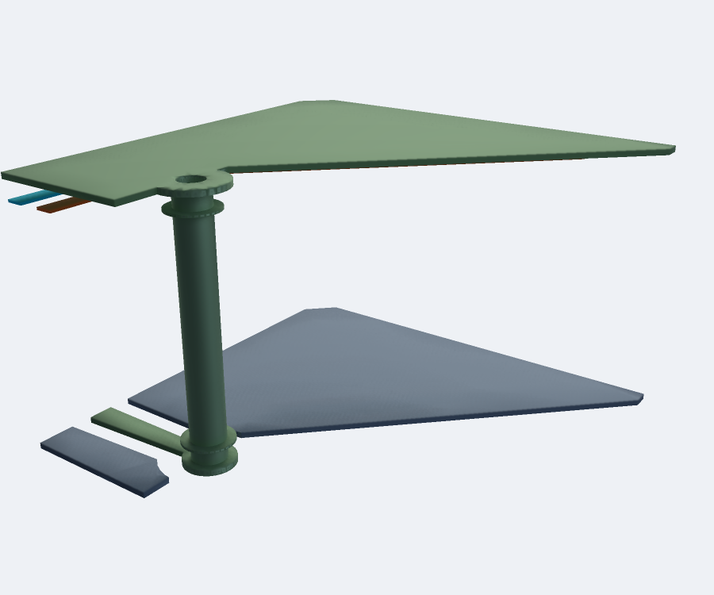
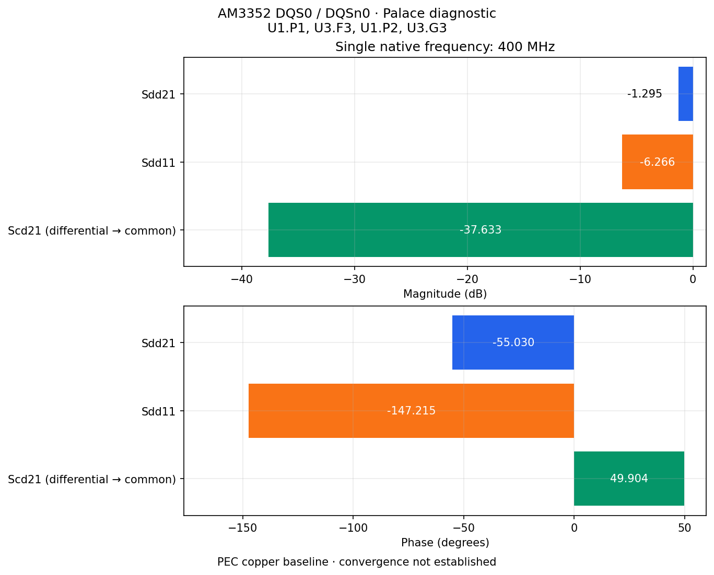

# Palace channel validation

This work separates three questions: whether the saved PCB mesh is consistent, whether the field extraction is numerically accurate, and whether the physical channel assumptions represent the board. An eye diagram should follow those checks, using the extracted broadband channel plus driver/receiver and timing models.

## Completed analytical benchmark

The parallel-plate control has a known TEM solution: length 10 mm, width 5 mm, separation 0.2 mm, relative permittivity 4, PEC plates and natural PMC side boundaries. The matched port impedance is 7.534606 Ω, propagation delay is 66.713 ps, `S11 = 0`, and `S21 = exp(-j 2π f delay)`. This checks field solution, units and port normalization independently of a PCB return-current approximation.

Palace 0.14.0 was run at 100 MHz, 400 MHz, 1 GHz, 2 GHz and 5 GHz, with first-order fields:

| Target size (mm) | Tetrahedra | Maximum complex S21 error | Maximum \|S11\| |
| --- | ---: | ---: | ---: |
| 1 | 383 | 4.47e-4 | 1.25e-3 |
| 0.5 | 1,455 | 1.25e-3 | 1.52e-3 |
| 0.25 | 6,055 | 6.25e-5 | 1.29e-4 |
| 0.125 | 22,959 | 8.62e-5 | 6.64e-5 |

Errors are not monotonic on these unstructured meshes. Both finer cases approach the exact solution to approximately `1e-4`; this is a benchmark agreement measurement, not an AM3352 convergence result. [Results](tem/results.json) and each directory's raw native log, config and S-parameter CSV are retained.

Reproduce a mesh and solve:

```sh
"$GMSH_PYTHON" scripts/palace/benchmark-tem.py --out work/tem --size 0.125
cd work/tem
palace -np 2 palace.json > palace.log 2>&1
cd ../..
"$GMSH_PYTHON" scripts/palace/check-tem.py work/tem --output work/tem-results.json
```

The analytical fixture is explicitly a mathematical boundary-value benchmark. PCB regressions and the channel control below generate circuit-json from TSX.

## Completed TSX PCB control

[`MultilayerBoard`](../../../tests/fixtures/multilayer-board.tsx) generates a four-layer board with two signal terminals, routed layer transitions, hollow plated vias and ground copper. The [control generator](../../../scripts/generate-palace-control.tsx) places native coplanar `U1.OUT` and `U2.IN` ports against their explicit GND net. It requires signal and reference continuity, and all saved-mesh checks pass.

The first-order extraction used 29,521 full-material tetrahedra, 50 Ω per port and the same five frequencies. Both excitation directions completed. The largest reciprocity error is `1.12e-7`; the largest S-matrix singular value is `0.999983`. These are numerical consistency checks, not established discretization convergence.


[Raw Touchstone](tsx-control/channel.s2p), [report](tsx-control/channel-report.json), [solver receipt](tsx-control/solver-input.json) and configs are retained. The corresponding native logs and raw CSV columns are in [the reader test fixture](../../../tests/fixtures/palace-channel). Tests reject incomplete sweeps and report deliberately nonpassive data without correcting it. A constructed four-port parser test checks differential/common-mode polarity and Touchstone ordering; it is not a native four-port simulation.

Both second-order excitation directions also completed. The [second-order report and raw results](tsx-control/p2/channel-report.json) have a maximum reciprocity error of `4.60e-7`, but the maximum change from first order is **0.199** in a complex S entry. The first-order PCB result is therefore **not converged** under the 0.01 criterion. This is precisely why consistency checks alone are insufficient for judging routing. One second-order direction used the default polynomial multigrid preconditioner (378 s); the other used a full-order complex SuperLU preconditioner (131 s). Their preserved configs show those linear-solver settings; both used residual tolerance `1e-8`.

Both [third-order excitation directions](tsx-control/p3/channel-report.json) completed using polynomial multigrid (1,960 s and 2,044 s). Maximum reciprocity error is `9.66e-7` and maximum scattering singular value is `0.999994`. The [three-order comparison](tsx-control/refinement.json) reports maximum complex changes of **0.199** from order 1 → 2 and **0.0362** from order 2 → 3. This control **still fails** the 0.01 discretization criterion. A full-order direct third-order attempt ended with SIGKILL under the workspace's 16 GiB memory limit; its [incomplete log](tsx-control/p3-direct-incomplete.log) is retained and is excluded from channel results.


The [per-frequency comparison values](tsx-control/refinement-samples.csv) preserve the raw sample differences; a clock-frequency point cannot establish an eye model over the edge-transition bandwidth.

At **400 MHz only**, a separate second-order spatial-refinement study used target mesh sizes 0.8, 0.6 and 0.4 mm (29,521, 36,313 and 61,340 full-material tetrahedra). Both directions completed on each mesh. The maximum complex S changes were **0.00290** and **0.00204**, passing the 0.01 discretization comparison. [Raw results and comparison](tsx-control/400mhz/refinement.json) are retained. This is a validated numerical comparison for the control at one frequency; it does not establish broadband eye accuracy or the AM3352 physical model. Repeat `generate-palace-control.tsx --mesh-size SIZE` at each size, prepare with `--order 2 --frequency-hz 400000000`, run both columns, then compare all three directories.

The same second-order **0.8 → 0.6 → 0.4 mm** spatial study has now completed across all five diagnostic frequencies. Both directions pass numerical consistency on each mesh, but maximum complex S changes are **0.01133** and **0.01116**, so the broadband study still fails the 0.01 comparison. [Reports, raw logs/CSV and Touchstone](tsx-control/spatial/refinement.json) are retained. The 0.6 mm excitations took 532/543 s; the 0.4 mm excitations took 852/710 s (mean MPI-rank wall time; these runs shared the workstation with CAD jobs).


To plot a freshly solved study, `plot-refinement.py` first revalidates the native data and comparison, then writes the raw sample changes, report and figure:

```sh
"$GMSH_PYTHON" scripts/palace/plot-refinement.py \
  --runs work/h08 work/h06 work/h04 \
  --labels 'h = 0.8 mm' 'h = 0.6 mm' 'h = 0.4 mm' \
  --output-directory work/refinement --title 'PCB control spatial refinement'
```

A symmetric [four-port TSX control](../../../tests/fixtures/differential-board.tsx) also completed all four native Palace excitations on 32,287 full-material tetrahedra. Its maximum reciprocity error is `4.66e-9` and maximum scattering singular value is `0.999999609`. Each excitation took 11.3–12.6 s (mean MPI-rank wall time). These are complete raw solver samples; discretization convergence is not established. At 5 GHz, the differential-to-common transmission magnitude is 0.00854; this coarse symmetric control must not be treated as an exact zero-conversion reference.


[Touchstone](tsx-fourport-control/channel.s4p), [mixed-mode CSV](tsx-fourport-control/mixed-mode.csv), [report](tsx-fourport-control/channel-report.json), [solver receipt](tsx-fourport-control/solver-input.json) and [native reader fixture](../../../tests/fixtures/palace-differential-channel) are retained. The explicit port order is `U1.OUT, U2.IN, U3.OUT, U4.IN`, with `--pairs '1,3;2,4'`. Reproduce it with:

```sh
bun scripts/generate-palace-control.tsx --differential --mesh-size 0.5 --output work/fourport
"$GMSH_PYTHON" scripts/palace/prepare-channel.py --mesh-directory work/fourport --output work/fourport-channel \
  --frequency-hz 100000000 400000000 1000000000 2000000000 5000000000
# Run every palace-N.json, saving palace-N.log.
"$GMSH_PYTHON" scripts/palace/read-channel.py work/fourport-channel --pairs '1,3;2,4'
```

To reproduce the oblique control, run `generate-palace-control.tsx --oblique --mesh-size 0.6`, then the same `rectangularize-ports.py` and Palace preparation steps. Its recorded solver control uses order 1 and AMS at 400 MHz; it is not a broadband convergence result.

Reproduction commands are in the [root README](../../../README.md#palace-channel-extraction).

## Actual AM3352 DQS0 case

**The corrected complete route and ideal port fixtures pass all nine native PCB mesh checks at minimum required quality `0.0001`. All four actual-board Palace columns now complete at 400 MHz with shifted real MUMPS and fixed `1e-8` residual tolerance. Numerical reciprocity/passivity checks pass. Mesh refinement and physical-model accuracy remain unproven, so this is a diagnostic extraction rather than a routing-quality eye.**

The input is the [pinned circuit-json](../mesh-validation/am3352.circuit.json.gz) and [stackup](../mesh-validation/stackup.json). Expanded JSON SHA-256: `c9d7059fe536865784f175855e0dcc76510972319eec848c18b0ef6dcd2adb40`.

### Geometry and saved-mesh evidence

A wall-only analysis crop nearly grazed via pad 230 at `(-2.200139, -27.600108) mm`, clipping `2.47e-6 mm²` and creating nanometre edges. The revised crop protects whole pads and plated walls with recorded clearance. It expands the analysis domain; it does not edit source copper. A [native TSX regression](../../../tests/corridor-pad.test.tsx) checks full-pad copper volume, complete signal/reference connectivity, stricter source and HXT meshes and a [PoppyGL snapshot](../../../tests/__snapshots__/whole-corridor-pad.png).



This PoppyGL view is the isolated actual copper tile: DDR_1V5 is green and GND is blue-gray. It is a geometry inspection view. Its [local native proof](pad-crop/preflight.json) records 25,573 tetrahedra, minimum quality `0.00780`, valid BRep and all eight applicable checks in 5.24 s. Complete-route connectivity is checked separately below.

| Complete case | Tetrahedra | Nodes | Minimum quality | Wall time |
| --- | ---: | ---: | ---: | ---: |
| [Delaunay source mesh](pad-crop/complete-mesh/validation.json) | 1,006,865 | 182,882 | 0.000123 | 3,952 s export + 20.84 s independent validation |
| [HXT source remesh](pad-crop/complete-hxt-mesh/validation.json) | 1,004,065 | 182,391 | 0.000227 | 667 s, reused conformal CAD |
| [Delaunay ideal port fixtures](pad-crop/complete-fixture-mesh/validation.json) | 1,006,135 | 182,770 | 0.000227 | 246 s |

Both source meshes pass every saved-mesh gate, including both DQS paths and all four connected DDR_1V5 reference probes. All 1,660 joined source BRep solids are independently valid. The fixture conversion preserves every PCB material volume and checks that each added ideal contact touches only its intended net. Passing these checks does not establish field accuracy or discretization convergence.

All 84 revised isolated HXT tiles also pass BRep and the eight applicable saved-mesh checks at threshold `0.0001`: 1,003,285 tetrahedra, minimum quality `0.000192`, 1,168 s with one worker. [Raw preflight evidence](pad-crop/tile-preflight/hxt-results.json) retains ownership, volume and worst-element receipts. Isolated triangulations can differ from the complete assembly; an isolated Delaunay air-tile quality failure did not recur after the complete join.

A resource-bounded global Boolean partition failed with `BOPAlgo_AlertIntersectionFailed`. [The native failure](pad-crop/global-partition-rejected/receipt.json) retains the original operands' catalog and hashes; all 364 operands independently pass BRep validation. That failed operation produces no accepted mesh. The complete accepted geometry uses the tiled strategy.

### Explicit ports and physical assumptions

The port order is:

1. `U1.P1` — DQS0 source positive
2. `U3.F3` — DQS0 load positive
3. `U1.P2` — DQSn0 source negative
4. `U3.G3` — DQSn0 load negative

The differential pairs are `--pairs '1,3;2,4'`: 50 Ω per leg, 100 Ω differential, 25 Ω common mode. Each aperture references nearby **top DDR_1V5 copper (`source_net_93`)**. Its native continuity is required. Bypass capacitors, PDN impedance, IC packages/terminations and switching aggressors are omitted. Other nearby copper remains passive, and continuations outside the corridor are truncated.

The original irregular coplanar apertures fail Palace's native direction check; [the unchanged rejection](complete-mesh/palace-1.log) is retained. Additional ideal PEC end contacts create rectangular openings without changing PCB material volumes. These solver fixtures are not manufactured copper or a proven de-embedding model. The current endpoint clearance is **1 µm**, width fraction 0.95. Strict validation rejected the earlier 1 nm fixture clearance; [rejected/accepted TSX evidence](port-fixtures/tsx-clearance) records the nearly flat face and its resolution. Fixture-size sensitivity remains required.

The diagnostic clock-frequency pilot uses **400 MHz**, an assumption rather than a confirmed firmware operating point. A clock frequency does not define an eye's bandwidth: edge transitions excite higher harmonics. The 0.75 mm corridor, 1 mm air enclosure, 1 µm physical-contour approximation, dielectric loss tangent 0.02 and PEC copper are sensitivity-study inputs. Crop, enclosure, fixture size, materials, copper loss and the reference/PDN model must be checked before judging the actual routing.

### Linear-solver evidence

[The complete native 400 MHz extraction](pad-crop/mumps-400mhz/receipt.json) retains all four configs, completed logs, CSV columns, container exit/OOM records, [Touchstone](pad-crop/mumps-400mhz/channel.s4p), [mixed-mode samples](pad-crop/mumps-400mhz/mixed-mode.csv) and [numerical report](pad-crop/mumps-400mhz/channel-report.json). GMRES iterations are **20, 20, 19, 19**; native mean-rank wall times are **224.36, 243.38, 317.01, 197.79 s**, with mesh jobs sharing the workstation. Every container exits zero without an OOM kill. Maximum reciprocity error is **`7.07e-8`**, maximum scattering singular value **`0.999465`**. These checks establish numerical consistency of these completed samples; refinement remains separate.



The plot uses differential 100 Ω and common-mode 25 Ω normalization. At this single point, `Sdd21 = -1.299 dB`, `Sdd11 = -6.266 dB`, `Scd21 = -37.633 dB`. These values depend on the stated port/reference/material/crop assumptions and have not passed mesh refinement. A single-frequency sample cannot establish routing quality or a transient eye.

On the corrected source and fixture mesh, vector AMS exhausted 1,200 iterations at relative residual **`4.771e-6`**, required `1e-8`. Its emitted scattering values are rejected. [Raw native log, config, solver input and rejection receipt](pad-crop/rejected-corrected-ams/receipt.json) are retained. A SuperLU comparison on the same mesh was killed with signal 9 before a completed field solve under a 14 GiB container limit. Additional root-cgroup OOM kills were observed; no per-container state was retained for that attempt, so exact attribution is not proven. [Raw rejection evidence](pad-crop/rejected-corrected-superlu/receipt.json) is retained.

The earlier positivity-only source mesh also failed AMS at [500 iterations](port-fixtures/am3352/rejected-500-iterations/receipt.json) and [1,200 iterations](port-fixtures/am3352/rejected-1200-iterations/receipt.json). Those cases are archived, not accepted channels. A native zero exit can accompany a failed solve; every column must pass `check-run.py` before extraction.

The full-board complex HSS attempt was also rejected: Docker confirms an out-of-memory kill under the 12 GiB container cap after 179.15 s, before a completed solve. [Native log and retained container state](pad-crop/rejected-corrected-hss/receipt.json) are preserved.

The oblique TSX control with 1 µm fixture clearance completes both SuperLU directions in 14.57/15.17 s, nine iterations each. Complex HSS compression at `1e-6` with right preconditioning completes both directions in **12.42/13.53 s**, five iterations each. Maximum complex S difference from SuperLU is **`3.48e-9`**, reciprocity error `4.01e-10`, maximum S singular value `0.999911`. [Raw HSS control and solver comparison](port-fixtures/tsx-clearance/accepted-hss/comparison.json) are retained. A looser real BLR attempt failed and is [explicitly rejected](port-fixtures/tsx-clearance/rejected-blr/receipt.json). This validates a standard solver comparison on the control; it does not establish actual-board refinement or an eye model. A real shifted MUMPS control completes both directions in 12 iterations (12.32/12.39 s), agreeing with SuperLU within `1.33e-9`. [Raw MUMPS control evidence](port-fixtures/tsx-clearance/accepted-mumps/comparison.json) is retained.

Both 0.8 mm coarse remeshes fail the same strict quality gate: [Delaunay](pad-crop/rejected-coarse-delaunay/receipt.json) has 641,674 tetrahedra and [HXT](pad-crop/rejected-coarse-hxt/receipt.json) has 649,575; each minimum quality is `0.0000384`, below `0.0001`. The other eight checks pass, including full connectivity. The offending element is air near an artificial tile plane. Neither mesh is accepted for a field solve; no threshold was relaxed.

The 0.6 mm source mesh passes all nine checks: [740,499 tetrahedra, minimum quality `0.000174`](pad-crop/h06-mesh/receipt.json). Its explicit fixture mesh also passes all gates with unchanged PCB volumes. Its four Palace columns now complete, with maximum reciprocity error `7.04e-8` and maximum S singular value `0.999515`. [All native columns and raw data](pad-crop/h06-mumps-400mhz/receipt.json) are retained. The 0.5 mm source mesh fails one strict air-element quality check ([minimum `0.0000203`](pad-crop/rejected-h05-delaunay/receipt.json)); it is excluded. The alternative 0.3 mm source mesh passes all nine checks: [1,345,567 tetrahedra, minimum quality `0.000283`](pad-crop/h03-mesh/receipt.json). Its unrefined Delaunay fixture failed at minimum quality `0.0000674`; HXT also failed that boundary element. [Both native rejections](pad-crop/rejected-h03-fixtures/receipt.json) are retained. A native local sizing box resolves it: [1,348,108 tetrahedra, minimum quality `0.000244`, all nine gates and BRep valid](pad-crop/h03-local-fixture-mesh/receipt.json), in 283.98 s. PCB material volumes and the complete port geometry remain unchanged. The box adds 2,423 elements relative to the rejected Delaunay fixture. Native mesh gates remain unchanged.

Refinement rereads native logs and CSV, invalidates a stale comparison output on failure, checks identical geometry/ports/reference impedances, and compares every complex single-ended entry. For a differential case, it also compares every mixed-mode entry using the same explicit polarity mapping. Both changes must meet the 0.01 criterion on the last two refinement steps. The regression demonstrates that mixed-mode changes can fail even when all single-ended changes pass.


The completed **0.6 → 0.4 mm** pair already fails the criterion: maximum single-ended complex change **0.05804**, maximum mixed-mode change **0.06904**, required 0.01. [The two-mesh diagnostic](pad-crop/two-mesh-diagnostic.json) retains both complete numerical reports; it is not a completed three-level study. The valid finer fixture reaches the 14 GiB resource limit with exact MUMPS after 132.05 s and tight BLR (`1e-8`) after 122.83 s. Both containers record `OOMKilled: true`; [exact](pad-crop/rejected-h03-mumps/receipt.json) and [compressed](pad-crop/rejected-h03-mumps-blr/receipt.json) values are rejected. With eight MPI ranks, Krylov size 40 and BLR `1e-6`, native factorization instead fails with `DMUMPS INFOG(1)=-40` after 197.31 s, without an OOM kill. [That failure](pad-crop/rejected-h03-mumps-blr-1e6/receipt.json) is also rejected.

The final exact shifted MUMPS attempt uses eight MPI ranks, a four-CPU cap and Krylov size 40. It reaches GMRES iteration 12, then is OOM-killed under 14 GiB after **304.94 s**. [Native log and container state](pad-crop/rejected-h03-exact8/receipt.json) are preserved. The valid finer mesh therefore has no complete accepted channel. Continuing this refinement requires a solver environment with more available memory; no exact minimum has been established. No accepted three-level refinement or routing-quality eye is claimed.

The same shifted MUMPS BLR settings complete both directions of the smaller TSX control. Against its complete SuperLU solution, maximum complex S differences are [**`1.67e-9` at BLR `1e-8`**](port-fixtures/tsx-clearance/accepted-mumps-blr-1e8/comparison.json) and [**`2.08e-9` at BLR `1e-6`**](port-fixtures/tsx-clearance/accepted-mumps-blr-1e6/comparison.json). [BLR `1e-4` fails native factorization even on the control](port-fixtures/tsx-clearance/rejected-mumps-blr-1e4/receipt.json). A successful control cannot guarantee successful factorization of the larger board.

### Reproduction

Generate the complete routes and all neighbouring copper inside the selected corridor:

```sh
bun scripts/validate-am3352-dqs.tsx \
  --board examples/am3352/mesh-validation/am3352.circuit.json.gz \
  --stackup examples/am3352/mesh-validation/stackup.json \
  --output work/am3352-dqs --mesh-size 0.4 --minimum-tet-quality 0.0001 \
  --threads 2 --fragment-strategy tiled --tile-size 2.5 --tile-workers 2 \
  --tile-cache work/cad-cache --air-padding 1 --palace-ports \
  --corridor-margin 0.75 --simplify-tolerance 0.001 --optimize-netgen
```

Add `--cad-checkpoint work/am3352-dqs` when exporting another directory with the same physical geometry and different mesh size/algorithm. Hash verification prevents reuse with changed geometry. `--tetrahedral-algorithm hxt` selects the alternative native tetrahedralizer; all validation gates still apply. A coarse remesh must pass independently before any field solve.

Reimprint explicit port fixtures and repeat native validation without repeating tile joins:

```sh
"$GMSH_PYTHON" scripts/palace/rectangularize-ports.py \
  --mesh-directory work/am3352-dqs --output work/am3352-fixtures \
  --mesh-size 0.4 --threads 2 --width-fraction 0.95 --contact-clearance 0.001
"$GMSH_PYTHON" scripts/palace/plot-port-fixtures.py \
  --mesh-directory work/am3352-fixtures --output work/port-fixtures.png
```

For the finer 0.3 mm source, a local native sizing field repairs the rejected air wedge without editing CAD. The seven values are XYZ lower bounds, XYZ upper bounds and target size, all in mm; repeat the flag for multiple boxes. Each target must be positive and no larger than the global target. The transition thickness equals the local target. Source and resulting meshes must still pass the complete quality/PCB gates:

```sh
"$GMSH_PYTHON" scripts/palace/rectangularize-ports.py \
  --mesh-directory work/am3352-h03 --output work/am3352-h03-fixtures \
  --mesh-size 0.3 --threads 1 \
  --refinement-box 2.0 -15.75 0.07 2.4 -15.35 0.15 0.05
```

Prepare the HSS diagnostic settings. This requires a Palace build with STRUMPACK:

```sh
"$GMSH_PYTHON" scripts/palace/prepare-channel.py \
  --mesh-directory work/am3352-fixtures --output work/am3352-channel \
  --frequency-hz 400000000 --linear-solver STRUMPACK \
  --compression HSS --compression-tolerance 0.000001 \
  --complex-coarse-solve --preconditioner-side Right \
  --max-iterations 500 --krylov-size 100
# Run palace-1.json through palace-4.json, retaining palace-N.log.
# Check each with check-run.py --log PATH --samples 1 before advancing.
"$GMSH_PYTHON" scripts/palace/read-channel.py work/am3352-channel --pairs '1,3;2,4'
```

The lower-storage shifted MUMPS pilot uses the same preparation command with `--linear-solver MUMPS --shifted-preconditioner --preconditioner-side Right` and omits the compression/complex-coarse flags. It retains the original complex field equations. The first 400 MHz full-board column completed in 20 iterations, native mean-rank wall time 224.36 s (235.16 s including container startup); all four native columns now complete as recorded above.

The compression tolerance approximates the preconditioner; the outer solve still requires `1e-8`. Every port/frequency must complete. Raw reciprocity/passivity checks then precede a three-level mesh comparison and physical-model sensitivity. Only a validated broadband extraction can support a routing-quality eye.

Earlier crop failures and their local reproductions remain in [the isolation receipts](crop-isolation), [the original complete mesh](complete-mesh) and [the original port fixture case](port-fixtures/am3352).

## Solver environment

Recorded runs use the pinned Docker image:

```text
benvial/palace@sha256:f0f3a3cbbdf1ee2d8f856ddbe1f5bf4628a92ee8ab87d1e27dc33402ad9c8dda
```

For a generated solver directory, the equivalent isolated command is:

```sh
cd work/control
docker run --rm --network none --user "$(id -u):$(id -g)" \
  --cap-drop ALL --security-opt no-new-privileges \
  --mount "type=bind,src=$PWD,dst=/case" --workdir /case \
  benvial/palace@sha256:f0f3a3cbbdf1ee2d8f856ddbe1f5bf4628a92ee8ab87d1e27dc33402ad9c8dda \
  palace -np 2 palace-1.json > palace-1.log 2>&1
```

Repeat for every generated port config. `Model.L0 = 0.001` converts mesh millimetres to SI; Palace configuration frequencies are GHz, while the preparation CLI accepts Hz. Optional plots use `scripts/palace/requirements-plots.txt` and `plot-channel.py`; they display raw samples without interpolation or channel fitting.
